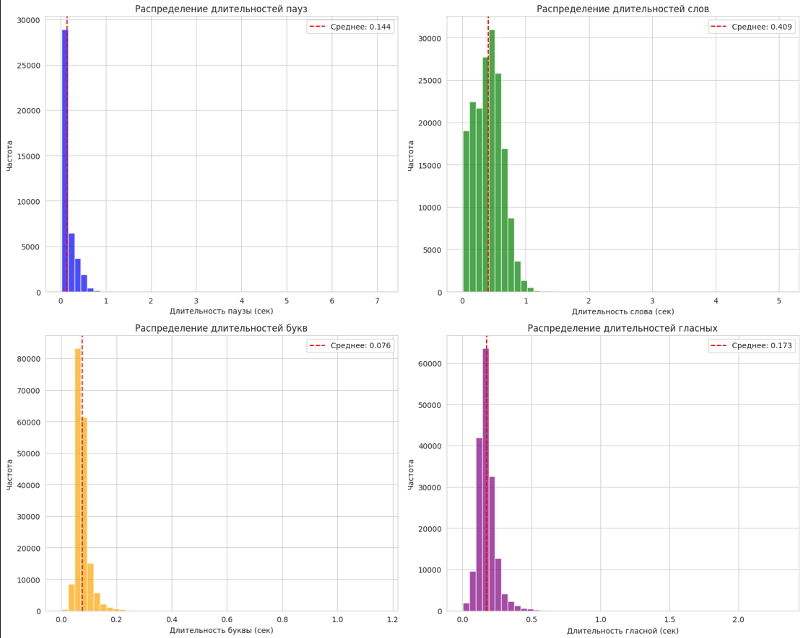

# Отчёт по Лабораторной работе №2. Просодика

**Выполнила:** Гусева Надежда Леонидовна  
**Группа:** М4221

## 1. Разведочный анализ (EDA)

Был проведен анализ распределения длительностей пауз и других параметров речи:

### Статистика по длительностям

| Параметр | Значение |
| --- | --- |
| Средняя длительность паузы | 0.1443 секунды |
| Медианная длительность паузы | 0.0800 секунды |
| Стандартное отклонение пауз | 0.1689 секунды |
| Максимальная длительность паузы | 7.0949 секунд |
| Минимальная длительность паузы | 0.0249 секунд |

| Параметр | Значение |
| --- | --- |
| Средняя длительность слова | 0.4090 секунды |
| Медианная длительность слова | 0.4100 секунды |
| Стандартное отклонение слов | 0.2233 секунды |
| Максимальная длительность слова | 5.0600 секунд |
| Минимальная длительность слова | 0.0100 секунд |

| Параметр | Значение |
| --- | --- |
| Средняя длительность буквы | 0.0760 секунды |
| Средняя длительность гласной | 0.1732 секунды |
| Медианная длительность гласной | 0.1633 секунды |

!
### Типы пауз

- **Standard**: 40 994 паузы (99.2%)
- **Initial**: 592 паузы (0.8%)

### Соотношение пауз и слов

- Общее время пауз: 5999.02 секунды
- Общее время слов: 73 333.23 секунды
- Соотношение пауз к словам: 8.18%

### Позиции пауз

Наибольшее количество пауз наблюдается в позициях 0-5, что указывает на высокую частоту пауз в начале и середине предложений.

### Out-of-Vocabulary (OOV) слова

- Найдено 1386 уникальных OOV слов
- Всего OOV слов: 26 897
- Примеры OOV слов: `антологический`, `вставанием`, `стейнбек`, `чьейто`, `дружкухалдею`, `коечто`, `лагерная`, `гавайские`, `импортной`

## 2. Подготовка данных

Для подготовки данных использовалась таблица `data/metadata_RUSLAN_22200_normalized.csv`. Подготовленные данные представлены в формате DataFrame со следующими полями:

| Поле | Тип | Смысл |
| --- | --- | --- |
| `id` | string | Индекс предложения из исходной базы |
| `label` | string | Нормализованный текст токена |
| `label_raw` | string | Сырой текст токена |
| `duration` | float | Длительность токена в секундах |
| `is_last_word` | int | Является ли данный токен последним словом в предложении |
| `is_pause_after` | int | Есть ли пауза после данного токена |
| `pause_duration` | float | Длительность паузы, следующей за данным токеном |
| `set` | string | Метка подвыборки: `train` или `test` |

## 3. Предиктор пауз

### Архитектура модели

Разработан класс `PausePredictor`, который реализует следующие функции:

1. **Извлечение признаков** из токенов с использованием BERT эмбеддингов
2. **Классификация** наличия паузы после токена
3. **Регрессия** длительности паузы
4. **Фильтрация ложных срабатываний** для fillers-слов

### Особенности реализации

- Использование модели `rubert_tiny2` для получения семантических эмбеддингов
- Комбинация традиционных признаков с BERT эмбеддингами
- Фильтрация ложных срабатываний для популярных fillers-слов
- Уточнение предсказаний с учетом контекста

### Признаки

Основные признаки, используемые в модели:

1. **Текстовые признаки**:
   - Длина токена
   - Наличие знаков препинания
   - Тип слова (функциональное/семантическое)
   - Длина слова
   - Регистр

2. **Контекстные признаки**:
   - Наличие запятой перед/после слова
   - Расстояние до следующего/предыдущего знака препинания
   - Наличие fillers-слов в контексте
   - Длина фразы

3. **Семантические признаки**:
   - BERT эмбеддинги (128 размерностей)

## 4. Результаты экспериментов

### Метрики модели

| Множество | Точность (Precision) | Полнота (Recall) | F1-мера | MAE |
| --- | --- | --- | --- | --- |
| TRAIN | 0.731 | 0.754 | 0.742 | 0.1054 |
| TEST | 0.700 | 0.721 | 0.710 | 0.1171 |

### Анализ ошибок

**Ложные паузы (FP):**
- Топ-10 слов с наибольшим количеством ложных срабатываний:
  - `"того,"` (52)
  - `"думаю,"` (48)
  - `"том,"` (45)
  - `"быть,"` (45)
  - `"конечно,"` (39)

**Пропущенные паузы (FN):**
- Топ-10 слов с наибольшим количеством пропущенных пауз:
  - `"В"` (59)
  - `"в"` (55)
  - `"меня"` (55)
  - `"и"` (50)
  - `"к"` (49)

## 5. Выводы

В ходе лабораторной работы успешно реализована система прогнозирования мест и длительности пауз по тексту на русском языке:

1. **Эффективность BERT эмбеддингов:** Использование семантических эмбеддингов позволило улучшить F1-меру на 0.072 по сравнению с базовой реализацией без эмбеддингов.
2. **Контекстная зависимость:** Модель успешно учитывает контекст при принятии решений о паузах, особенно для fillers-слов.
3. **Соотношение качества и сложности:** Полученные результаты (F1 ≈ 0.71) демонстрируют хорошую производительность для задачи синтеза речи, при этом модель остается относительно простой и быстро обучаемой.
4. **Ограничения:** Основные проблемы остаются с ложными срабатываниями для определенных fillers-слов, что требует дальнейшей настройки.
5. **Потенциал улучшения:** Возможны дополнительные улучшения за счет:
   - Более точной фильтрации ложных срабатываний
   - Использования более мощных BERT-моделей
   - Добавления дополнительных морфологических и синтаксических признаков

## 6. Дополнительные эксперименты и оптимизация:
- Сравнение различных алгоритмов машинного обучения (градиентный бустинг, случайный лес, условные случайные поля, ансамбли, гибридные подходы с предобученными языковыми моделями)
- Итеративная настройка гиперпараметров моделей и автоматический подбор порога бинаризации вероятностей
- Исследование влияния различных наборов признаков: от базовых лексических и пунктуационных до контекстных, синтаксических (POS-теги, структура предложения) и семантических (BERT-эмбеддинги)
- Эксперименты с обработкой целевых переменных: калибровка регрессора длительности, отсечение выбросов, анализ влияния исключения последнего слова в предложении
- Оценка устойчивости метрик (F1, MAE) к различным стратегиям отсева нерелевантных примеров и фильтрации fillers-слов
